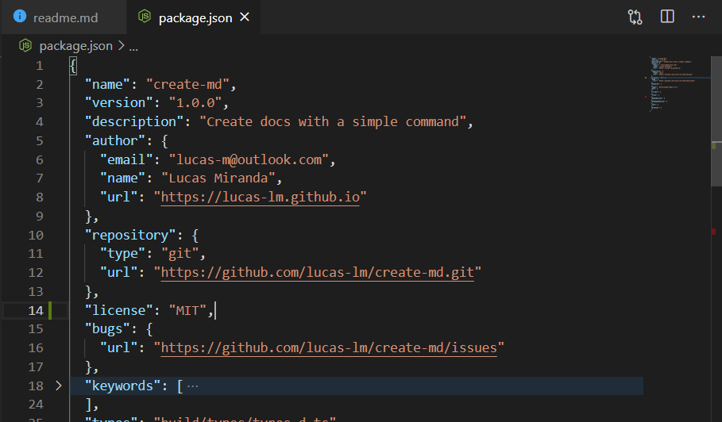

<p align='center'>
  
</p>
<h1 align='center'>:information_desk_person: Create Markdown</h1>
<h3 align='center'>Create docs with a simple command</h3>
<p align='center'>
  
  
  
</p>

## :pushpin: Table of Contents

- [:telescope: Overview](#telescope-overview)
  - [What can I do with create-md?](#what-can-i-do-with-create-md)
  - [Why did I make this?](#why-did-i-make-this)
- [:wrench: Requirements](#wrench-requirements)
- [:zap: Quick start](#zap-quick-start)
- [:tada: Usage](#tada-usage)
  - [Examples](#examples)
- [:sparkles: Features](#sparkles-features)
- [:computer: Techs](#computer-techs)
- [:bomb: Next steps](#bomb-next-steps)
- [:star2: Contributing](#star2-contributing)
- [:octocat: Author](#octocat-author)
- [:closed_book: License](#closed_book-license)

---

## :telescope: Overview

This simple CLI helps you to bootstrap a nice readme and licenses from the scratch.

> This readme was bootstrapped with create-md!

See a short demo below:


### What can I do with create-md?

Using the create-md CLI you can:

1. Create readme.md to your code
2. Create readme.md to your profile
3. Create license for your project


### Why did I make this?

Creating nice readmes, license and other docs for applications can be really boring, but it is an important step to make your project more understandable. In order to make this task easier, I create this CLI to automate the process of bootstrapping my readme and some other docs like licenses and issues templates.


## :wrench: Requirements

- [Node.js](https://nodejs.org)
- [npm](https://npmjs.com) or [yarn](https://yarnpkg.com)

## :zap: Quick start

There is no need to install the package. With modern versions of yarn and npm there is no need to install the package. You can run it directly with `yarn create` and `npm init`.

If you use yarn:

```sh
yarn create md
```

If you prefer npm:

```sh
npm init md
```

Creating license:

```sh
yarn create md license
```
```sh
npm init md license
```

Hint: A well filled package.json helps the CLI to infer some default answers. Look an example below:



## :tada: Usage

Call the CLI using `yarn create md <args>` or `npm init md <args>`. The create-md CLI take only one argument (template) and some options. If it is called with no argument, the default template will be used (readme). See below the list of available templates:

- readme (default)
- readme/profile (profile readme)
- license (MIT license)
- license/bsd2 (BSD2 license)

The table below describes the options available currently.

| Flag       | What is it?    | What does it do?                                         | Default value           |
|------------|----------------|----------------------------------------------------------| ------------------------|
| `--ext`    | File extension | Set the extension of the output file to the given value. | `.md`                   |
| `--name`   | File name      | Set the name of the output file to the given value.      | template's name         |
| `--outDir` | Output folder  | Set the folder for the output file.                      | cwd (current directory) |

### Examples

> Note: `yarn create` can be replaced by `npm init` in the examples.

Creating a readme named foo inside a folder named docs:
```sh
yarn create md readme --name=foo --outDir=docs
```

Creating a license with txt extension
```sh
yarn create md license --ext=txt
```

See more examples in [docs/example](docs/example).

## :sparkles: Features

- Generate md files
- Answer inference
- Modular templates

## :computer: Techs

Curious about technologies behind create-md? It is all about:

- [NodeJS](https://nodejs.org) - A JavaScript runtime built on Chrome's V8 JavaScript engine
- [TypeScript](https://typescriptlang.org) - Typed JavaScript at Any Scale
- [Gluegun](https://github.com/infinitered/gluegun) - A delightful toolkit for building Node-based CLIs

## :star2: Contributing

Contributions, issues and feature requests are welcome!

- ⭐️ Star the project
- 🐛 Find and report issues
- 📥 Submit PRs to help solve issues or add features

Feel free to check [issues page](https://github.com/lucas-lm/create-md/issues). You can also take a look at the contributing guide.

## :bomb: Next steps

- [x] Refactor the basecode
- [x] Feature: ask if user want to overwrite files if already exists
- [ ] Feature: Auto generate table of contents
- [ ] Write tests
- [ ] Feature: take custom templates as argument
- [ ] Create more templates: gitignore, issues etc.
- [ ] Feature: flag `--all` must create default markdowns (readme, license, issues etc.) in batch
- [ ] Feature: flag `--yes` must skip questionaire and get only default (inferred) answers
- [ ] Allow .create-md (maybe .cmrc or .createmdrc, who knows...) config file

## :octocat: Author

**Lucas Miranda** 
* Email: lucas-m@outlook.com
* Website: https://lucas-lm.github.io
* GitHub: [@lucas-lm](https://github.com/lucas-lm)
* LinkedIn: [@lucas-lm](https://linkedin.com/in/lucas-lm)

## :closed_book: License

Copyright © 2020 Lucas Miranda
This project is [MIT](license.md) licensed.
